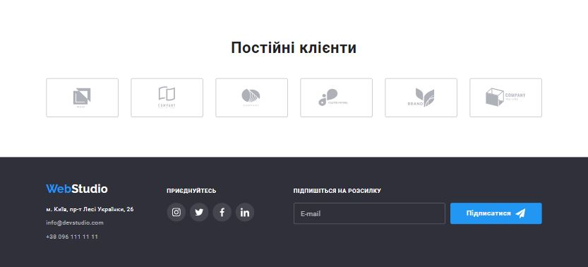
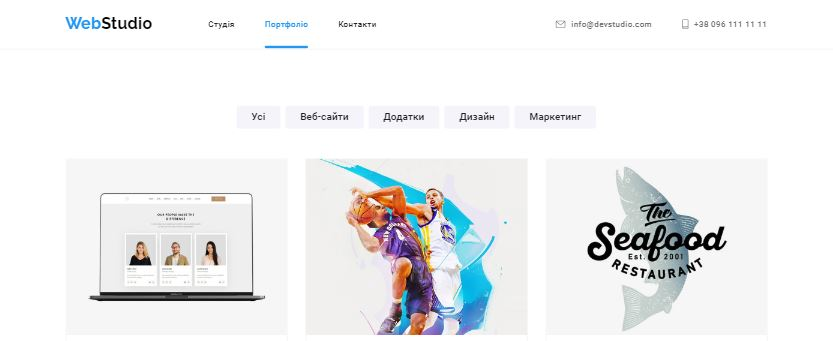

# WebStudio

 


This is the repository for the "WebStudio" project, which contains the website for a web design and
development studio.

## 🌐 Links

👉 [WebStudio Website](https://liubomyr-vynn.github.io/WebStudio/index.html)

## 📖 Description

"WebStudio" is a website for a studio specializing in innovative web design and development. Our
team of experts in web technology is ready to provide you with creative and effective solutions for
your online projects.

## 💼 Services

- 🎨 Web design and redesign.
- 🌐 Web development and e-commerce solutions.
- 📱 Mobile app development.
- 💻 Web development and programming.

## 📂 Repository Contents

In this repository, you will find the following:

- 🌐 HTML/CSS/JavaScript files for creating the website.
- 🖼️ Images and multimedia resources used on the site.
- 🎨 Stylesheets and scripts for the website.

## ▶️ How to Run Locally

If you wish to run this project locally on your computer, follow these steps:

1. Clone this repository:

   ```bash
   git clone https://github.com/liubomyr-vynn/WebStudio.git
   cd WebStudio
   ```
